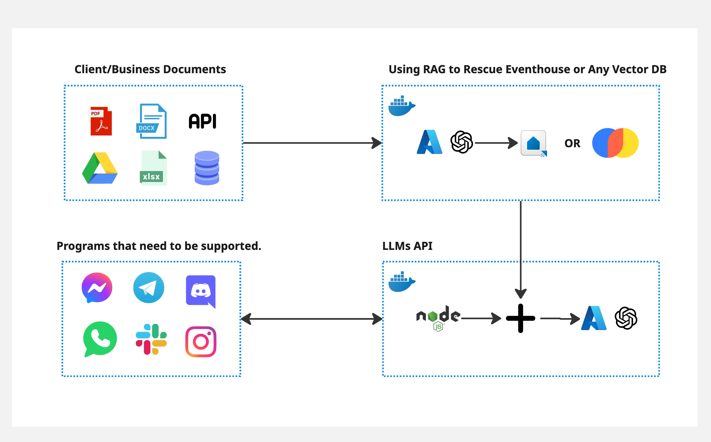

# 🚀 Data OpenAI RAG Demo

## 📝 Overview

This project implements a **Retrieval-Augmented Generation (RAG)** pipeline using **Azure OpenAI, ChromaDB**, and **Node.js** to process client/business documents and integrate with various messaging platforms.



## 🌟 Features

- 📄 Supports multiple document formats: **PDF, DOCX, XLSX, CSV, and APIs**.
- 🧠 Uses **ChromaDB** for vector embeddings.
- 🤖 Retrieves relevant data using **Azure OpenAI**.
- 💬 Connects with platforms like **WhatsApp, Telegram, Messenger, Discord, Slack, and Instagram**.
- 🐳 Deployed using **Docker** for scalability.

## 📂 Folder Structure

```
📦 data_openai_rag_demo
├── 📂 chroma_db        # Stores vector embeddings
├── 📂 documents        # Contains business/client documents
├── 📂 venv             # Virtual environment for dependencies
├── 📄 .env             # Environment variables
├── 📄 .gitignore       # Git ignore file
├── 📄 chat_system.py   # Core chat logic
├── 📄 file_processing.py # Processes documents and generates embeddings
├── 📄 README.md        # Project documentation
├── 📄 demo.jpg         # Project architecture diagram
```

## ⚙️ Installation

### ✅ Prerequisites

- 🐍 Python 3.8+
- 🌐 Node.js 16+
- 🐳 Docker
- 💻 Virtual environment (optional but recommended)

### 🔧 Setup

1. **Clone the repository:**
   ```bash
   git clone https://github.com/your-repo/data_openai_rag_demo.git
   cd data_openai_rag_demo
   ```
2. **Create and activate a virtual environment:**
   ```bash
   python -m venv venv
   source venv/bin/activate  # On Windows: venv\Scripts\activate
   ```
3. **Install dependencies:**
   ```bash
   pip install -r requirements.txt
   ```
4. **Set up environment variables:**

   - Create a `.env` file and add your **Azure OpenAI** and **ChromaDB** credentials.

5. **Run the file processing script:**

   ```bash
   python file_processing.py
   python chat_system.py
   ```

## 🚀 Usage

- 📂 The system reads all documents from the `documents/` folder.
- 🧠 Processes them using **ChromaDB** and generates embeddings.
- 🤖 Connects with **Azure OpenAI** to generate responses.
- 🔗 Integrates with messaging platforms via **Node.js API**.

## 📧 Contact

For any inquiries, reach out to: **📩 balkibumen@gmail.com**
